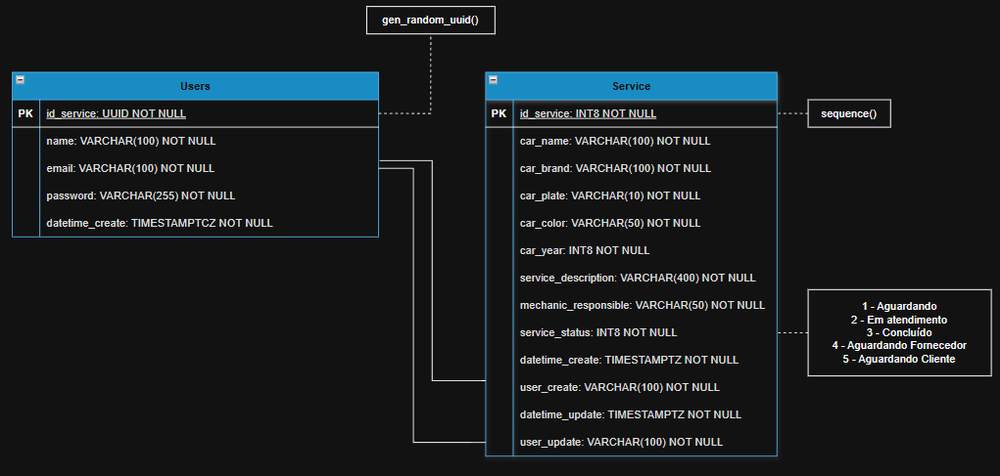
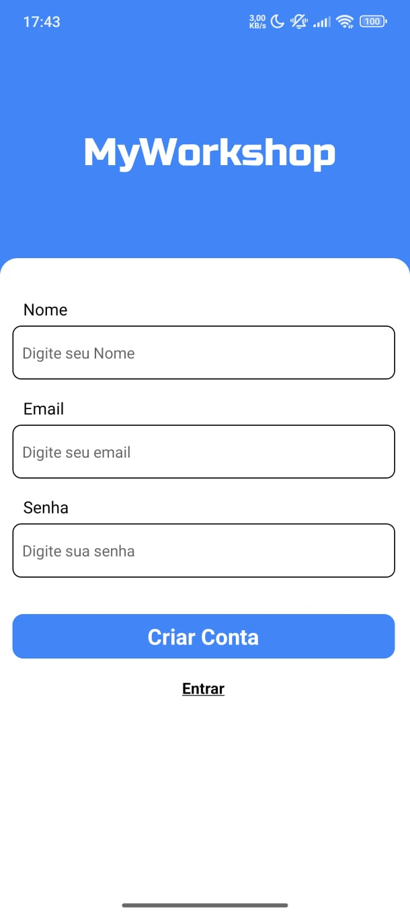
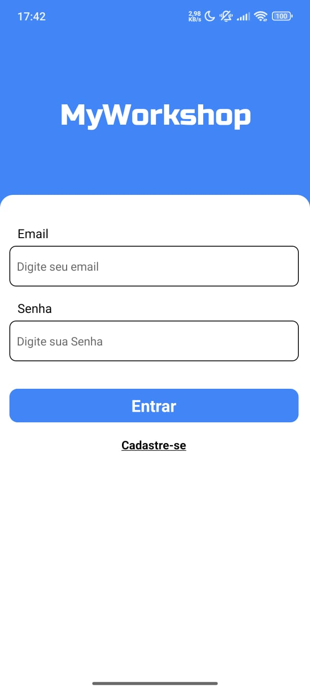
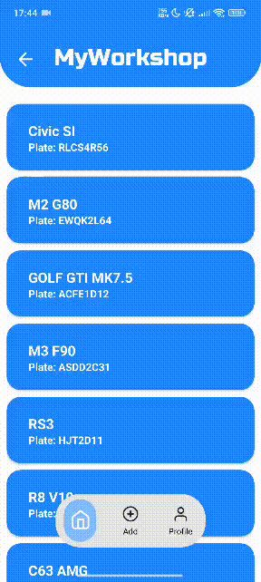

# My Workshop

## 📌 Description

Hybrid application for controlling vehicles undergoing maintenance in offices.  

---

## 👨‍💻 Developer

- **Name:** Gustavo Alfredo Correa Da Silva

---

## 🎓 Course Information

- **University:** PUC Paraná - Curitiba 
- **Postgraduate Course:** Mobile Application Development  
- **Course:** Webservices and MBaaS

---

## 🔧 Project Features

This application provides complete maintenance management through:

### **Authentication**
- **Sign-Up:** Create account 
- **Sign-In:** Enter the app

### **CRUD Operations**
- **Create:** Add a new vehicle to the maintenance queue.  
- **Read All:** View all vehicles currently undergoing service.  
- **Read One:** View detailed information for a specific vehicle.  
- **Update:** Modify vehicle details during maintenance.  
- **Delete:** Remove a vehicle after maintenance completion.

---

## 🛠 Technical Stack

- **Programming Language:** [TypeScript](https://www.typescriptlang.org/)    
- **Framework:** [React Native](https://reactnative.dev/) 
- **Facilitator:** [Expo](https://expo.dev/)  
- **Backend as a Service (BaaS):** [Supabase](https://supabase.com/)  

---

## 🧰 Tools Used

- **IDE:** [Visual Studio Code](https://code.visualstudio.com/)    
- **UI/UX Design:** [Figma](https://www.figma.com/pt-br/)  

---

## 🧾 UML Diagram

<p align="center">
  
</p>

---

## 📱 Screens of Project

<p align="center">
  
  
  
</p>

---

## 🚀 How to Run the Project

```bash
# Clone this repository
git clone <url>

# Navigate to the project folder
cd my-workshop

# Install dependencies
npm install

# Run the project
npx expo start
